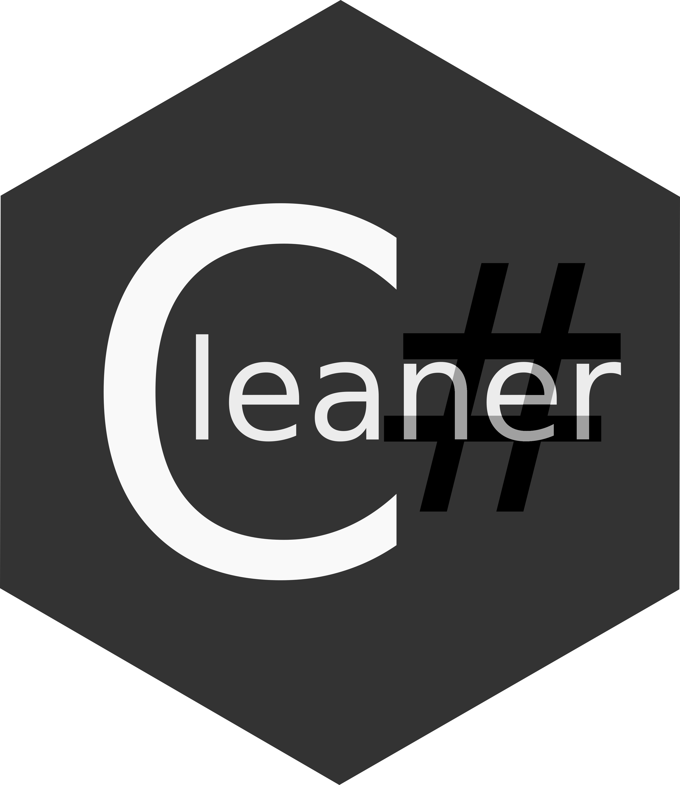
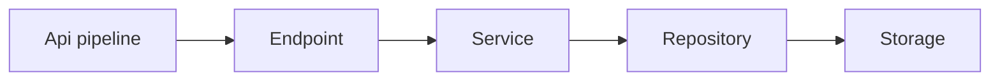

<hr>

# CleanerSharpApi
**CleanerSharpApi** is a clean architecture C# library for building maintainable APIs following SOLID and RESTful principles. It provides a structured approach to CRUD operations with clear separation between data access (Repository), business logic (Entity Service), and request handling (Endpoint).

## Architecture
The Architecture of the library consists of **3 Main parts** or layers which are :

1- **Repository**

2- **Service**

3- **Endpoint**

and in the main architecture of the API those layers should be the most inner layers of the API after all the Authentication and authorization and any other checks that are general to request and do not care about the specifics and internal details of the request

**Figure 1**

Keep in mind that internally the library is designed as a bunch of base interfaces and you'll find that the Repository , EntityService and Endpoint interfaces all inhirate the same ICrud interface and don't add anything extra and that is right. it's just to give a base for applying the architecture cleanly and differentiate between different responsibilities

every interface in this library inhirates from some **Action** interface and all Action interfaces describe different actions and there are 4 different classes of actions 

**1- Synchronous Crud Actions:** represented in the **ICrud** interface which represent the basic CRUD actions as **Create**,**Read**,**Update** and **Delete** 

```csharp
public interface ICrud<
    TCreateResult,
    TCreateInput,
    TReadResult,
    TReadQuery,
    TUpdateResult,
    TUpdateQuery,
    TUpdateInput,
    TDeleteQuery
>
    : ICreate<TCreateResult, TCreateInput>,
        IRead<TReadResult, TReadQuery>,
        IUpdate<TUpdateResult, TUpdateQuery, TUpdateInput>,
        IDelete<TDeleteQuery> { }
```

**2- Asynchronous Crud Actions:** represented in the **ICrudAsync** interface which represent an asynchronous version of the basic CRUD actions as **CreateAsync**,**ReadAsync**,**UpdateAsync** and **DeleteAsync** 

```csharp
public interface ICrudAsync<
    TCreateResult,
    TCreateInput,
    TReadResult,
    TReadQuery,
    TUpdateResult,
    TUpdateQuery,
    TUpdateInput,
    TDeleteQuery
>
    : ICreateAsync<TCreateResult, TCreateInput>,
        IReadAsync<TReadResult, TReadQuery>,
        IUpdateAsync<TUpdateResult, TUpdateQuery, TUpdateInput>,
        IDeleteAsync<TDeleteQuery> { }
```

**3- Synchronous Crud-Many Actions:** represented in the **ICrudMany** interface which represent basic **CRUD** actions on a list of entities in **CreateMany**, **ReadMany**, **UpdateMany** and **DeleteMany**

```csharp
public interface ICrudMany<
    TCreateResult,
    TCreateInput,
    TReadResult,
    TReadQuery,
    TUpdateResult,
    TUpdateQuery,
    TUpdateInput,
    TDeleteQuery
>
    : ICreateMany<TCreateResult, TCreateInput>,
        IReadMany<TReadResult, TReadQuery>,
        IUpdateMany<TUpdateResult, TUpdateQuery, TUpdateInput>,
        IDeleteMany<TDeleteQuery> { }
```
**4- Asynchornous Crud-Many Actions:** represented in the **ICrudManyAsync** interface which represent basic **CRUD** actions on a list of entities asynchronously in the actions **CreateManyAsync**, **ReadManyAsync**, **UpdateManyAsync** and **DeleteManyAsync**

```csharp
public interface ICrudManyAsync<
    TCreateResult,
    TCreateInput,
    TReadResult,
    TReadQuery,
    TUpdateResult,
    TUpdateQuery,
    TUpdateInput,
    TDeleteQuery
>
    : ICreateManyAsync<TCreateResult, TCreateInput>,
        IReadManyAsync<TReadResult, TReadQuery>,
        IUpdateManyAsync<TUpdateResult, TUpdateQuery, TUpdateInput>,
        IDeleteManyAsync<TDeleteQuery> { }
```

## Rules
Please make sure to follow this set of rules:

1- Returning a value always means **Success** even if it was **Null**, a Failure should be represented as an **Exception**

2- **Exceptions** can be thrown at any part of the pipeline indicating safe failure

3- Always keep each implementation Isolated focused on it's own responsibility regardless of others

4- Always make sure to follow the **SOLID** principles and make **RESTful** Apis , the library is designed for that anyway

5- Always try not to skip , follow the pipeline even if that layer is just a pass through adding no value to the pipeline 

6- Repositories will always be Wrappers around an actual storage system either EF core or any other storage out there you are planning to use in your Api

7- Always be minimal , don't try to handle every case just a generic or specific version of your own case


These are a set of rules to make sure you always write clean and readable code

## Responsibilities

### Repository
The **Repository**'s responsibility is all about communicating to the **Storage** fetching the data and storing it in the appropriate way and format.

### Service
The **Service**'s responsibility is all about business logic and entity-specific logic weather it's accessibility or processing

### Endpoint
The **Endpoint**'s responsibility is all about the **request and response** where it calls the correct functions to performe the user's specified request and return the appropriate response

> **Note:** Each of the layers can consist of multiple internal layers on the inside depending on your use case 


## Examples

Honstly the example would take 